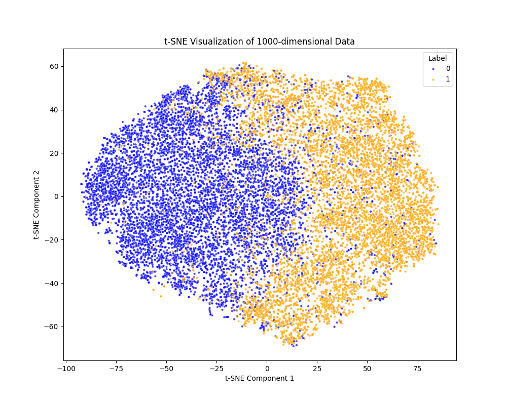

# Parasitized Cell Classification Using Convolutional Neural Networks

This report outlines the implementation of a convolutional neural network (CNN)-based machine learning model designed to predict whether a cell is parasitized by the genus *Plasmodium*. The task is simplified by the fact that each image in the dataset contains only a single cell, with labels of `0` (uninfected) and `1` (parasitized). The project leverages various pre-trained models, adapts them with custom sequential layers for fine-tuning, and finally evaluates the model on a test set. Predictions are then submitted on Kaggle.

---

## Project Summary

- **Objective:**  
  Implement a CNN-based model to classify whether a cell in an image is parasitized by *Plasmodium* or not.
  
- **Dataset:**  
  The training dataset consists of images with a single cell each. Each image is labeled with `0` (uninfected) or `1` (parasitized).

- **Approach:**  
  - Utilize pre-trained models (e.g., ResNet, VGG, DenseNet, MobileNetV3, EfficientNet, etc.) to leverage ImageNet weights.
  - Replace the final classification layers with custom sequential layers tailored for binary classification.
  - Optionally freeze the pre-trained weights to focus training on the newly added classifier layers.
  - Achieve high accuracy (a bit more than 96%) on the validation/test set.

- **Extra Credit:**  
  Extract the learned embeddings (from layers within the classifier) and visualize them using t-SNE. The extracted embeddings, specifically the 1000-dimensional output from the `Linear(in_features=1280, out_features=1000, bias=True)` layer, show a clear separation between healthy and parasitized cells.

---

## The `load_model` Function

The `load_model` function is central to the project and serves the following purposes:

1. **Model Selection:**  
   Based on the input parameter `name`, the function loads one of several pre-trained models (e.g., ResNet variants, VGG, DenseNet, MobileNetV3, EfficientNet, RegNet, ConvNeXt) using pre-trained ImageNet weights.

2. **Layer Freezing:**  
   By default, all layers are frozen to preserve the pre-trained weights. This behavior can be modified by setting the `nofreeze` flag to `True`, which allows all layers to be trainable.

3. **Custom Classifier Replacement:**  
   For each model architecture, the final classification layer is replaced with a custom sequential block tailored for binary classification. For instance:
   - **ResNet:** Replaces the fully connected layer (`model.fc`) with a series of linear layers interleaved with ReLU activations.
   - **VGG:** Modifies the last classifier layer.
   - **DenseNet, MobileNet, EfficientNet, RegNet, ConvNeXt:** Similarly, their respective classifier layers are replaced to suit the binary classification task.

4. **Model Finalization:**  
   The function counts and prints the number of trainable and non-trainable parameters, moves the model to the specified device (CPU or GPU), and returns the final model.

Below is the complete `load_model` function:

```python
def load_model(name, device="cpu", pretrained_path="", nofreeze=False):

    if name == "resnet18":
        model = models.resnet18(weights=models.ResNet18_Weights.IMAGENET1K_V1)
    elif name == "resnet34":
        model = models.resnet34(weights=models.ResNet34_Weights.IMAGENET1K_V1)
    elif name == "resnet50":
        model = models.resnet50(weights=models.ResNet50_Weights.IMAGENET1K_V1)
    elif name == "resnet101":
        model = models.resnet101(weights=models.ResNet101_Weights.IMAGENET1K_V1)
    elif name == "resnet152":
        model = models.resnet152(weights=models.ResNet152_Weights.IMAGENET1K_V1)
    elif name == "vgg16":
        model = models.vgg16(weights=models.VGG16_Weights.IMAGENET1K_V1)
    elif name == "vgg19":
        model = models.vgg19(weights=models.VGG19_Weights.IMAGENET1K_V1)
    elif name == "densenet121":
        model = models.densenet121(weights=models.DenseNet121_Weights.IMAGENET1K_V1)
    elif name == "densenet169":
        model = models.densenet169(weights=models.DenseNet169_Weights.IMAGENET1K_V1)
    elif name == "mobilenet_v3":
        model = models.mobilenet_v3_large(weights=models.MobileNet_V3_Large_Weights.IMAGENET1K_V1)
    elif name == "efficientnet_b0":
        model = models.efficientnet_b0(weights=models.EfficientNet_B0_Weights.IMAGENET1K_V1)
    elif name == "efficientnet_b3":
        model = models.efficientnet_b3(weights=models.EfficientNet_B3_Weights.IMAGENET1K_V1)
    elif name == "regnet_y_400mf":
        model = models.regnet_y_400mf(weights=models.RegNet_Y_400MF_Weights.IMAGENET1K_V1)
    elif name == "convnext_tiny":
        model = models.convnext_tiny(weights=models.ConvNeXt_Tiny_Weights.IMAGENET1K_V1)
    else:
        raise ValueError(f"Model {name} not recognized")

    # Freeze all layers
    if not nofreeze:
        print("Freezing model...")
        for p in model.parameters():
            p.requires_grad = False
    else:
        print("Using full model... (no freeze)")
        for p in model.parameters():
            p.requires_grad = True

    ## RESNET ##
    if "resnet" in name:
        for p in model.fc.parameters():
            p.requires_grad = True
        model.fc = nn.Sequential(
            nn.Linear(model.fc.in_features, 512),  # 2048 -> n
            nn.ReLU(),
            nn.Linear(512, 128),
            nn.ReLU(),
            nn.Linear(128, 64),
            nn.ReLU(),
            nn.Linear(64, 32),
            nn.ReLU(),
            nn.Linear(32, 1)
        )
        model.save_layer = model.fc
        if pretrained_path != "":
            model.fc.load_state_dict(torch.load(pretrained_path))
            print(f"Using model from: {pretrained_path}")

    ## VGG ##
    elif "vgg" in name:
        for p in model.classifier[-1].parameters():
            p.requires_grad = True
        model.classifier[-1] = nn.Sequential(
            nn.Linear(model.classifier[-1].in_features, 512),  # 4096
            nn.ReLU(),
            nn.Linear(512, 128),
            nn.ReLU(),
            nn.Linear(128, 64),
            nn.ReLU(),
            nn.Linear(64, 32),
            nn.ReLU(),
            nn.Linear(32, 1)
        )
        model.save_layer = model.classifier[-1]
        if pretrained_path != "":
            model.classifier[-1].load_state_dict(torch.load(pretrained_path))
            print(f"Using model from: {pretrained_path}")

    ## DENSENET ##
    elif "densenet" in name:
        for p in model.classifier.parameters():
            p.requires_grad = True
        model.classifier = nn.Sequential(
            nn.Dropout(0.2),
            nn.Linear(model.classifier.in_features, 1000),  # 1024 / 1664
            nn.ReLU(),
            nn.Linear(1000, 1)
        )
        model.save_layer = model.classifier
        if pretrained_path != "":
            model.classifier.load_state_dict(torch.load(pretrained_path))
            print(f"Using model from: {pretrained_path}")

    ## MOBILENET ##
    elif "mobilenet" in name:
        for p in model.classifier[-1].parameters():
            p.requires_grad = True
        model.classifier[-1] = nn.Sequential(
            nn.Dropout(0.2),
            nn.Linear(model.classifier[-1].in_features, 1000),  # 1024 / 1664
            nn.ReLU(),
            nn.Linear(1000, 1)
        )
        model.save_layer = model.classifier[-1]
        if pretrained_path != "":
            model.classifier[-1].load_state_dict(torch.load(pretrained_path))
            print(f"Using model from: {pretrained_path}")

    ## EFFICIENTNET ##
    elif "efficientnet" in name:
        for p in model.classifier.parameters():
            p.requires_grad = True
        model.classifier = nn.Sequential(
            nn.Dropout(0.2),
            nn.Linear(model.classifier[-1].in_features, 1000),  # 1024 / 1664
            nn.ReLU(),
            nn.Linear(1000, 1)
        )
        model.save_layer = model.classifier
        if pretrained_path != "":
            model.classifier.load_state_dict(torch.load(pretrained_path))
            print(f"Using model from: {pretrained_path}")

    ## REGNET ##
    elif "regnet" in name:
        for p in model.fc.parameters():
            p.requires_grad = True
        model.fc = nn.Sequential(
            nn.Linear(model.fc.in_features, 1000),  # 440 -> 1000
            nn.ReLU(),
            nn.Linear(1000, 512),
            nn.ReLU(),
            nn.Linear(512, 1)
        )
        model.save_layer = model.fc
        if pretrained_path != "":
            model.fc.load_state_dict(torch.load(pretrained_path))
            print(f"Using model from: {pretrained_path}")

    ## CONVNEXT ##
    elif "convnext" in name:
        for p in model.classifier[-1].parameters():
            p.requires_grad = True
        model.classifier[-1] = nn.Sequential(
            nn.Linear(model.classifier[-1].in_features, 1000),  # 768
            nn.ReLU(),
            nn.Linear(1000, 512),
            nn.ReLU(),
            nn.Linear(512, 1)
        )
        model.save_layer = model.classifier[-1]
        if pretrained_path != "":
            model.classifier[-1].load_state_dict(torch.load(pretrained_path))
            print(f"Using model from: {pretrained_path}")

    # Print the number of trainable and non-trainable parameters
    trainable, non_trainable = count_parameters(model)
    print(f"Trainable parameters: {trainable}")
    print(f"Non-trainable parameters: {non_trainable}")

    model = model.to(device)
    return model
```

---

## Final Model Architecture

The final model that achieved a bit more than 96% accuracy is based on **MobileNetV3**. Below is the complete architecture of the MobileNetV3 model with its custom classifier:

```plaintext
MobileNetV3(
  (features): Sequential(
    (0): Conv2dNormActivation(
      (0): Conv2d(3, 16, kernel_size=(3, 3), stride=(2, 2), padding=(1, 1), bias=False)
      (1): BatchNorm2d(16, eps=0.001, momentum=0.01, affine=True, track_running_stats=True)
      (2): Hardswish()
    )
    (1): InvertedResidual(
      (block): Sequential(
        (0): Conv2dNormActivation(
          (0): Conv2d(16, 16, kernel_size=(3, 3), stride=(1, 1), padding=(1, 1), groups=16, bias=False)
          (1): BatchNorm2d(16, eps=0.001, momentum=0.01, affine=True, track_running_stats=True)
          (2): ReLU(inplace=True)
        )
        (1): Conv2dNormActivation(
          (0): Conv2d(16, 16, kernel_size=(1, 1), stride=(1, 1), bias=False)
          (1): BatchNorm2d(16, eps=0.001, momentum=0.01, affine=True, track_running_stats=True)
        )
      )
    )
    (2): InvertedResidual(
      (block): Sequential(
        (0): Conv2dNormActivation(
          (0): Conv2d(16, 64, kernel_size=(1, 1), stride=(1, 1), bias=False)
          (1): BatchNorm2d(64, eps=0.001, momentum=0.01, affine=True, track_running_stats=True)
          (2): ReLU(inplace=True)
        )
        (1): Conv2dNormActivation(
          (0): Conv2d(64, 64, kernel_size=(3, 3), stride=(2, 2), padding=(1, 1), groups=64, bias=False)
          (1): BatchNorm2d(64, eps=0.001, momentum=0.01, affine=True, track_running_stats=True)
          (2): ReLU(inplace=True)
        )
        (2): Conv2dNormActivation(
          (0): Conv2d(64, 24, kernel_size=(1, 1), stride=(1, 1), bias=False)
          (1): BatchNorm2d(24, eps=0.001, momentum=0.01, affine=True, track_running_stats=True)
        )
      )
    )
    (3): InvertedResidual(
      (block): Sequential(
        (0): Conv2dNormActivation(
          (0): Conv2d(24, 72, kernel_size=(1, 1), stride=(1, 1), bias=False)
          (1): BatchNorm2d(72, eps=0.001, momentum=0.01, affine=True, track_running_stats=True)
          (2): ReLU(inplace=True)
        )
        (1): Conv2dNormActivation(
          (0): Conv2d(72, 72, kernel_size=(3, 3), stride=(1, 1), padding=(1, 1), groups=72, bias=False)
          (1): BatchNorm2d(72, eps=0.001, momentum=0.01, affine=True, track_running_stats=True)
          (2): ReLU(inplace=True)
        )
        (2): Conv2dNormActivation(
          (0): Conv2d(72, 24, kernel_size=(1, 1), stride=(1, 1), bias=False)
          (1): BatchNorm2d(24, eps=0.001, momentum=0.01, affine=True, track_running_stats=True)
        )
      )
    )
    (4): InvertedResidual(
      (block): Sequential(
        (0): Conv2dNormActivation(
          (0): Conv2d(24, 72, kernel_size=(1, 1), stride=(1, 1), bias=False)
          (1): BatchNorm2d(72, eps=0.001, momentum=0.01, affine=True, track_running_stats=True)
          (2): ReLU(inplace=True)
        )
        (1): Conv2dNormActivation(
          (0): Conv2d(72, 72, kernel_size=(5, 5), stride=(2, 2), padding=(2, 2), groups=72, bias=False)
          (1): BatchNorm2d(72, eps=0.001, momentum=0.01, affine=True, track_running_stats=True)
          (2): ReLU(inplace=True)
        )
        (2): SqueezeExcitation(
          (avgpool): AdaptiveAvgPool2d(output_size=1)
          (fc1): Conv2d(72, 24, kernel_size=(1, 1), stride=(1, 1))
          (fc2): Conv2d(24, 72, kernel_size=(1, 1), stride=(1, 1))
          (activation): ReLU()
          (scale_activation): Hardsigmoid()
        )
        (3): Conv2dNormActivation(
          (0): Conv2d(72, 40, kernel_size=(1, 1), stride=(1, 1), bias=False)
          (1): BatchNorm2d(40, eps=0.001, momentum=0.01, affine=True, track_running_stats=True)
        )
      )
    )
    (5): InvertedResidual(
      (block): Sequential(
        (0): Conv2dNormActivation(
          (0): Conv2d(40, 120, kernel_size=(1, 1), stride=(1, 1), bias=False)
          (1): BatchNorm2d(120, eps=0.001, momentum=0.01, affine=True, track_running_stats=True)
          (2): ReLU(inplace=True)
        )
        (1): Conv2dNormActivation(
          (0): Conv2d(120, 120, kernel_size=(5, 5), stride=(1, 1), padding=(2, 2), groups=120, bias=False)
          (1): BatchNorm2d(120, eps=0.001, momentum=0.01, affine=True, track_running_stats=True)
          (2): ReLU(inplace=True)
        )
        (2): SqueezeExcitation(
          (avgpool): AdaptiveAvgPool2d(output_size=1)
          (fc1): Conv2d(120, 32, kernel_size=(1, 1), stride=(1, 1))
          (fc2): Conv2d(32, 120, kernel_size=(1, 1), stride=(1, 1))
          (activation): ReLU()
          (scale_activation): Hardsigmoid()
        )
        (3): Conv2dNormActivation(
          (0): Conv2d(120, 40, kernel_size=(1, 1), stride=(1, 1), bias=False)
          (1): BatchNorm2d(40, eps=0.001, momentum=0.01, affine=True, track_running_stats=True)
        )
      )
    )
    (6): InvertedResidual(
      (block): Sequential(
        (0): Conv2dNormActivation(
          (0): Conv2d(40, 120, kernel_size=(1, 1), stride=(1, 1), bias=False)
          (1): BatchNorm2d(120, eps=0.001, momentum=0.01, affine=True, track_running_stats=True)
          (2): ReLU(inplace=True)
        )
        (1): Conv2dNormActivation(
          (0): Conv2d(120, 120, kernel_size=(5, 5), stride=(1, 1), padding=(2, 2), groups=120, bias=False)
          (1): BatchNorm2d(120, eps=0.001, momentum=0.01, affine=True, track_running_stats=True)
          (2): ReLU(inplace=True)
        )
        (2): SqueezeExcitation(
          (avgpool): AdaptiveAvgPool2d(output_size=1)
          (fc1): Conv2d(120, 32, kernel_size=(1, 1), stride=(1, 1))
          (fc2): Conv2d(32, 120, kernel_size=(1, 1), stride=(1, 1))
          (activation): ReLU()
          (scale_activation): Hardsigmoid()
        )
        (3): Conv2dNormActivation(
          (0): Conv2d(120, 40, kernel_size=(1, 1), stride=(1, 1), bias=False)
          (1): BatchNorm2d(40, eps=0.001, momentum=0.01, affine=True, track_running_stats=True)
        )
      )
    )
    (7): InvertedResidual(
      (block): Sequential(
        (0): Conv2dNormActivation(
          (0): Conv2d(40, 240, kernel_size=(1, 1), stride=(1, 1), bias=False)
          (1): BatchNorm2d(240, eps=0.001, momentum=0.01, affine=True, track_running_stats=True)
          (2): Hardswish()
        )
        (1): Conv2dNormActivation(
          (0): Conv2d(240, 240, kernel_size=(3, 3), stride=(2, 2), padding=(1, 1), groups=240, bias=False)
          (1): BatchNorm2d(240, eps=0.001, momentum=0.01, affine=True, track_running_stats=True)
          (2): Hardswish()
        )
        (2): Conv2dNormActivation(
          (0): Conv2d(240, 80, kernel_size=(1, 1), stride=(1, 1), bias=False)
          (1): BatchNorm2d(80, eps=0.001, momentum=0.01, affine=True, track_running_stats=True)
        )
      )
    )
    (8): InvertedResidual(
      (block): Sequential(
        (0): Conv2dNormActivation(
          (0): Conv2d(80, 200, kernel_size=(1, 1), stride=(1, 1), bias=False)
          (1): BatchNorm2d(200, eps=0.001, momentum=0.01, affine=True, track_running_stats=True)
          (2): Hardswish()
        )
        (1): Conv2dNormActivation(
          (0): Conv2d(200, 200, kernel_size=(3, 3), stride=(1, 1), padding=(1, 1), groups=200, bias=False)
          (1): BatchNorm2d(200, eps=0.001, momentum=0.01, affine=True, track_running_stats=True)
          (2): Hardswish()
        )
        (2): Conv2dNormActivation(
          (0): Conv2d(200, 80, kernel_size=(1, 1), stride=(1, 1), bias=False)
          (1): BatchNorm2d(80, eps=0.001, momentum=0.01, affine=True, track_running_stats=True)
        )
      )
    )
    (9): InvertedResidual(
      (block): Sequential(
        (0): Conv2dNormActivation(
          (0): Conv2d(80, 184, kernel_size=(1, 1), stride=(1, 1), bias=False)
          (1): BatchNorm2d(184, eps=0.001, momentum=0.01, affine=True, track_running_stats=True)
          (2): Hardswish()
        )
        (1): Conv2dNormActivation(
          (0): Conv2d(184, 184, kernel_size=(3, 3), stride=(1, 1), padding=(1, 1), groups=184, bias=False)
          (1): BatchNorm2d(184, eps=0.001, momentum=0.01, affine=True, track_running_stats=True)
          (2): Hardswish()
        )
        (2): Conv2dNormActivation(
          (0): Conv2d(184, 80, kernel_size=(1, 1), stride=(1, 1), bias=False)
          (1): BatchNorm2d(80, eps=0.001, momentum=0.01, affine=True, track_running_stats=True)
        )
      )
    )
    (10): InvertedResidual(
      (block): Sequential(
        (0): Conv2dNormActivation(
          (0): Conv2d(184, 184, kernel_size=(1, 1), stride=(1, 1), bias=False)
          (1): BatchNorm2d(184, eps=0.001, momentum=0.01, affine=True, track_running_stats=True)
          (2): Hardswish()
        )
        (1): Conv2dNormActivation(
          (0): Conv2d(184, 184, kernel_size=(3, 3), stride=(1, 1), padding=(1, 1), groups=184, bias=False)
          (1): BatchNorm2d(184, eps=0.001, momentum=0.01, affine=True, track_running_stats=True)
          (2): Hardswish()
        )
        (2): Conv2dNormActivation(
          (0): Conv2d(184, 80, kernel_size=(1, 1), stride=(1, 1), bias=False)
          (1): BatchNorm2d(80, eps=0.001, momentum=0.01, affine=True, track_running_stats=True)
        )
      )
    )
    (11): InvertedResidual(
      (block): Sequential(
        (0): Conv2dNormActivation(
          (0): Conv2d(80, 480, kernel_size=(1, 1), stride=(1, 1), bias=False)
          (1): BatchNorm2d(480, eps=0.001, momentum=0.01, affine=True, track_running_stats=True)
          (2): Hardswish()
        )
        (1): Conv2dNormActivation(
          (0): Conv2d(480, 480, kernel_size=(3, 3), stride=(1, 1), padding=(1, 1), groups=480, bias=False)
          (1): BatchNorm2d(480, eps=0.001, momentum=0.01, affine=True, track_running_stats=True)
          (2): Hardswish()
        )
        (2): SqueezeExcitation(
          (avgpool): AdaptiveAvgPool2d(output_size=1)
          (fc1): Conv2d(480, 120, kernel_size=(1, 1), stride=(1, 1))
          (fc2): Conv2d(120, 480, kernel_size=(1, 1), stride=(1, 1))
          (activation): ReLU()
          (scale_activation): Hardsigmoid()
        )
        (3): Conv2dNormActivation(
          (0): Conv2d(480, 112, kernel_size=(1, 1), stride=(1, 1), bias=False)
          (1): BatchNorm2d(112, eps=0.001, momentum=0.01, affine=True, track_running_stats=True)
        )
      )
    )
    (12): InvertedResidual(
      (block): Sequential(
        (0): Conv2dNormActivation(
          (0): Conv2d(112, 672, kernel_size=(1, 1), stride=(1, 1), bias=False)
          (1): BatchNorm2d(672, eps=0.001, momentum=0.01, affine=True, track_running_stats=True)
          (2): Hardswish()
        )
        (1): Conv2dNormActivation(
          (0): Conv2d(672, 672, kernel_size=(3, 3), stride=(1, 1), padding=(1, 1), groups=672, bias=False)
          (1): BatchNorm2d(672, eps=0.001, momentum=0.01, affine=True, track_running_stats=True)
          (2): Hardswish()
        )
        (2): SqueezeExcitation(
          (avgpool): AdaptiveAvgPool2d(output_size=1)
          (fc1): Conv2d(672, 168, kernel_size=(1, 1), stride=(1, 1))
          (fc2): Conv2d(168, 672, kernel_size=(1, 1), stride=(1, 1))
          (activation): ReLU()
          (scale_activation): Hardsigmoid()
        )
        (3): Conv2dNormActivation(
          (0): Conv2d(672, 112, kernel_size=(1, 1), stride=(1, 1), bias=False)
          (1): BatchNorm2d(112, eps=0.001, momentum=0.01, affine=True, track_running_stats=True)
        )
      )
    )
    (13): InvertedResidual(
      (block): Sequential(
        (0): Conv2dNormActivation(
          (0): Conv2d(112, 672, kernel_size=(1, 1), stride=(1, 1), bias=False)
          (1): BatchNorm2d(672, eps=0.001, momentum=0.01, affine=True, track_running_stats=True)
          (2): Hardswish()
        )
        (1): Conv2dNormActivation(
          (0): Conv2d(672, 672, kernel_size=(5, 5), stride=(2, 2), padding=(2, 2), groups=672, bias=False)
          (1): BatchNorm2d(672, eps=0.001, momentum=0.01, affine=True, track_running_stats=True)
          (2): Hardswish()
        )
        (2): SqueezeExcitation(
          (avgpool): AdaptiveAvgPool2d(output_size=1)
          (fc1): Conv2d(672, 168, kernel_size=(1, 1), stride=(1, 1))
          (fc2): Conv2d(168, 672, kernel_size=(1, 1), stride=(1, 1))
          (activation): ReLU()
          (scale_activation): Hardsigmoid()
        )
        (3): Conv2dNormActivation(
          (0): Conv2d(672, 160, kernel_size=(1, 1), stride=(1, 1), bias=False)
          (1): BatchNorm2d(160, eps=0.001, momentum=0.01, affine=True, track_running_stats=True)
        )
      )
    )
    (14): InvertedResidual(
      (block): Sequential(
        (0): Conv2dNormActivation(
          (0): Conv2d(160, 960, kernel_size=(1, 1), stride=(1, 1), bias=False)
          (1): BatchNorm2d(960, eps=0.001, momentum=0.01, affine=True, track_running_stats=True)
          (2): Hardswish()
        )
        (1): Conv2dNormActivation(
          (0): Conv2d(960, 960, kernel_size=(5, 5), stride=(1, 1), padding=(2, 2), groups=960, bias=False)
          (1): BatchNorm2d(960, eps=0.001, momentum=0.01, affine=True, track_running_stats=True)
          (2): Hardswish()
        )
        (2): SqueezeExcitation(
          (avgpool): AdaptiveAvgPool2d(output_size=1)
          (fc1): Conv2d(960, 240, kernel_size=(1, 1), stride=(1, 1))
          (fc2): Conv2d(240, 960, kernel_size=(1, 1), stride=(1, 1))
          (activation): ReLU()
          (scale_activation): Hardsigmoid()
        )
        (3): Conv2dNormActivation(
          (0): Conv2d(960, 160, kernel_size=(1, 1), stride=(1, 1), bias=False)
          (1): BatchNorm2d(160, eps=0.001, momentum=0.01, affine=True, track_running_stats=True)
        )
      )
    )
    (15): InvertedResidual(
      (block): Sequential(
        (0): Conv2dNormActivation(
          (0): Conv2d(160, 960, kernel_size=(1, 1), stride=(1, 1), bias=False)
          (1): BatchNorm2d(960, eps=0.001, momentum=0.01, affine=True, track_running_stats=True)
          (2): Hardswish()
        )
        (1): Conv2dNormActivation(
          (0): Conv2d(960, 960, kernel_size=(5, 5), stride=(1, 1), padding=(2, 2), groups=960, bias=False)
          (1): BatchNorm2d(960, eps=0.001, momentum=0.01, affine=True, track_running_stats=True)
          (2): Hardswish()
        )
        (2): SqueezeExcitation(
          (avgpool): AdaptiveAvgPool2d(output_size=1)
          (fc1): Conv2d(960, 240, kernel_size=(1, 1), stride=(1, 1))
          (fc2): Conv2d(240, 960, kernel_size=(1, 1), stride=(1, 1))
          (activation): ReLU()
          (scale_activation): Hardsigmoid()
        )
        (3): Conv2dNormActivation(
          (0): Conv2d(960, 160, kernel_size=(1, 1), stride=(1, 1), bias=False)
          (1): BatchNorm2d(160, eps=0.001, momentum=0.01, affine=True, track_running_stats=True)
        )
      )
    )
    (16): Conv2dNormActivation(
      (0): Conv2d(160, 960, kernel_size=(1, 1), stride=(1, 1), bias=False)
      (1): BatchNorm2d(960, eps=0.001, momentum=0.01, affine=True, track_running_stats=True)
      (2): Hardswish()
    )
  )
  (avgpool): AdaptiveAvgPool2d(output_size=1)
  (classifier): Sequential(
    (0): Linear(in_features=960, out_features=1280, bias=True)
    (1): Hardswish()
    (2): Dropout(p=0.2, inplace=True)
    (3): Sequential(
      (0): Dropout(p=0.2, inplace=False)
      (1): Linear(in_features=1280, out_features=1000, bias=True)
      (2): ReLU()
      (3): Linear(in_features=1000, out_features=1, bias=True)
    )
  )
  (save_layer): Sequential(
    (0): Dropout(p=0.2, inplace=False)
    (1): Linear(in_features=1280, out_features=1000, bias=True)
    (2): ReLU()
    (3): Linear(in_features=1000, out_features=1, bias=True)
  )
)
```

---

## Embedding Extraction and t-SNE Visualization

As an extra credit, the project involved extracting the learned embeddings from the model. Specifically, the output from the layer:

```plaintext
Linear(in_features=1280, out_features=1000, bias=True)
```

is used as the embedding. These 1000-dimensional embeddings are then visualized using t-SNE, which revealed a clear separation between healthy (label `0`) and parasitized (label `1`) cells.

Below is an example snippet (conceptual) used for the t-SNE visualization:

```python
# Assuming embeddings is a torch.Tensor of shape [17636, 1000] extracted from model.save_layer
embeddings_np = embeddings.cpu().detach().numpy()

from sklearn.manifold import TSNE
import matplotlib.pyplot as plt

tsne = TSNE(n_components=2, random_state=42)
X2d = tsne.fit_transform(embeddings_np)

# Plotting the t-SNE result with binary color coding
plt.figure(figsize=(10, 8))
plt.scatter(X2d[:, 0], X2d[:, 1], c=labels, cmap='viridis', s=1, alpha=0.7)
plt.colorbar(label='Cell State (0: Healthy, 1: Parasitized)')
plt.title('t-SNE Visualization of Learned Embeddings')
plt.xlabel('t-SNE Component 1')
plt.ylabel('t-SNE Component 2')
plt.show()
```

The resulting plot ([t-sne.png](./t-sne.png)) demonstrates a distinct separation between the two classes, confirming that the model has learned meaningful features that differentiate between healthy and parasitized cells.



---

## Conclusion

- **Model Development:**  
  Multiple pre-trained architectures were explored with a custom fine-tuning layer for binary classification. The `load_model` function efficiently loads and configures the chosen architecture.

- **Performance:**  
  The final model (MobileNetV3-based) achieved over 96% accuracy on the dataset.

- **Extra Credit Insight:**  
  The extracted 1000-dimensional embeddings, visualized via t-SNE, showed a clear separation between healthy and parasitized cells, indicating that the model successfully learned discriminative features.

This project not only demonstrates effective transfer learning but also highlights the value of visualizing high-dimensional embeddings to gain insights into the model's internal representations.